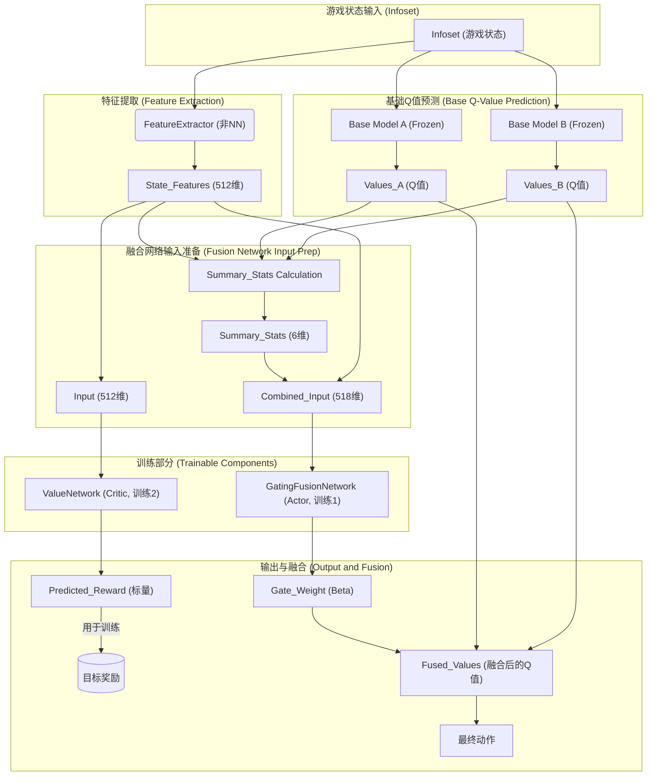

# Readme

这是一个为斗地主（Doudizhu）AI设计的**动态动作级模型融合**项目。

本项目的核心思想不是从零开始训练一个全新的模型，而是借鉴 [DouZero (Kwai)](https://github.com/kwai/DouZero) 和 [PerfectDou (Netease)](https://github.com/Netease-Games-AI-Lab-Guangzhou/PerfectDou) 的思路，将两个或多个预训练的强大模型（例如 DouZero 的 ADP 和 WP 模型）进行**动态融合**。

融合在“动作层面”(Action-Level）进行：在游戏的每一步决策时，一个可训练的**门控融合网络 (Gating Fusion Network)** 会实时分析当前的游戏状态（包括手牌、出牌历史、甚至两个基础模型的决策差异），然后动态地决定两个基础模型（如 ADP 和 WP）的输出权重，最后加权计算出最终的动作价值。

这种方法使得AI可以根据局势动态切换策略：在优势局，它可能更相信 WP（胜率）模型的决策以求稳；在劣势局或关键时刻，它可能更相信 ADP（得分）模型的决策来博取高分。

## 目录

[TOC]

## 网络架构

本项目的核心是训练一个**门控融合网络 (Gating Network)**，而两个基础模型（Base Model A, Base Model B）的权重是**冻结不变**的。

### 整体数据流图 (Text-based Diagram)

为了帮助您理解，这里是整个决策和训练的数据流：



整体决策流程如下：

1.  **基础模型推理 (Base Model Inference)**
    -   给定当前游戏状态 `infoset`。
    -   冻结的 **模型A (例如 DouZero-ADP)** 计算所有合法动作的价值（Q-values）：`V_A`。
    -   冻结的 **模型B (例如 DouZero-WP)** 计算所有合法动作的价值（Q-values）：`V_B`。
    -   这一步由 `dual_model.py` 中的 `DualModelInference` 类完成。
2.  **状态特征提取 (State Feature Extraction)**
    -   `feature_extractor.py` 中的 `ActionLevelFeatureExtractor` 模块从 `infoset` 中提取一个高维特征向量 `S` (例如 512 维)。
    -   这个特征 `S` 包含了：
        -   当前手牌特征（例如单牌、对子、炸弹的数量）。
        -   游戏阶段特征（例如游戏是刚开始还是接近尾声）。
        -   历史动作特征（例如已经打出了多少牌）。
        -   对手信息特征（例如对手剩余手牌数量）。
        -   **模型差异特征 (Model Disagreement Features)**：这是最关键的特征之一，包括 `V_A` 和 `V_B` 之间的统计差异（如均值、最大值差异）以及它们最优动作的一致性。
3.  **门控网络决策 (Gating Network Decision)**
    -   可训练的 **门控融合网络 (GatingFusionNetwork)**（定义于 `fusion_network.py`）是一个小型的多层感知机 (MLP)。
    -   它接收 `state_features` 和 `V_A`, `V_B` 的摘要信息作为输入。
    -   它输出一个**单一标量门控权重 $\beta$**（例如，通过 Sigmoid 激活，并限制在 `[0.1, 0.9]` 之间，以确保两个模型始终有贡献）。
    -   $\beta$ = `GatingNetwork(S)`
4.  **最终动作选择 (Final Action Selection)**
    -   融合后的动作价值 `V_fused` 通过加权平均计算得出：
    -   **$V_{fused} = \beta \cdot V_A + (1 - \beta) \cdot V_B$**
    -   AI 最终选择 `V_fused` 中价值最高的动作。

此外，还有一个并行的**价值网络 (Value Network)**（定义于 `trainer.py`），它也是一个 MLP，用于估计当前状态 `S` 的预期最终回报（即 Critic 部分），辅助 Actor（门控网络）的训练。

### 特征提取器 (ActionLevelFeatureExtractor)

这不是一个神经网络，但它是架构的**输入源**。

-   **文件**: `feature_extractor.py`
-   **作用**: 它的 `extract_features` 方法负责从 `infoset` (游戏状态) 和 `model_outputs` (基础模型输出) 中提取一个高维特征向量。
-   **包含内容**:
    -   手牌特征 (`_encode_hand_cards`)
    -   游戏阶段特征 (`_encode_game_phase`)
    -   位置编码 (`_encode_position`)
    -   历史动作 (`_encode_action_history`)
    -   对手信息 (`_encode_opponents`)
    -   **模型差异特征** (`_encode_model_disagreement`)：这是关键，它分析 `values_a` 和 `values_b` 的差异，如Q值均值、最大值差异、动作排序一致性等。
-   **输出**: 一个被填充或截断到 `feature_dim` (默认为 **512**) 维的 `torch.tensor`。这个向量是后续两个神经网络的主要输入。

### 门控融合网络 (GatingFusionNetwork) - (Actor)

这是**第一块可训练**的网络，负责**决策**。

-   **文件**: `fusion_network.py`
-   **作用**: 接收状态特征和模型输出摘要，然后输出一个**标量门控权重 $\beta$**（例如 0.7），用于决定如何加权 `values_a` 和 `values_b`。
-   **输入**: 它的输入由两部分在 `forward` 方法中动态拼接而成：
    1.  **`state_features`**: 来自特征提取器的 **512** 维向量。
    2.  **`summary` (摘要统计)**: 一个实时的 **6** 维向量，包含 `values_a` 和 `values_b` 的均值、最大值和差异等统计。
-   **总输入维度**: 512 + 6 = **518** 维。
-   **网络层级 (基于默认参数)**:

| **层 (Layer)** | **类型 (Type)** | **输入神经元 (Input)** | **输出神经元 (Output)** | **激活函数 (Activation)** | **作用 (Function)**                            |
| -------------- | --------------- | ---------------------- | ----------------------- | ------------------------- | ---------------------------------------------- |
| `fc1`          | `nn.Linear`     | 518                    | 256                     | `ReLU`                    | 第一次特征变换                                 |
| `fc2`          | `nn.Linear`     | 256                    | 128                     | `ReLU`                    | 第二次特征变换                                 |
| `gate`         | `nn.Linear`     | 128                    | 1                       | `Sigmoid` (scaled)        | 输出范围在 `[0.1, 0.9]` 之间的门控权重 $\beta$ |

-   **输出**: 一个标量 `gate_weights` (即 $\beta$)。最终的融合Q值计算为：`fused_values = gate_weights * values_a + (1 - gate_weights) * values_b`。

### 价值网络 (ValueNetwork) - (Critic)

这是**第二块可训练**的网络，负责**评估**。

-   **文件**: `trainer.py` (在 `ActionFusionTrainer` 的 `__init__` 中定义)
-   **作用**: 接收与 Actor *几乎相同*的状态特征，并预测当前状态的**预期最终回报**（例如，预测这局游戏最终会赢 (+1.0) 还是输 (-1.0)）。这个预测值在训练中用于计算 `value_loss` (价值损失)。
-   **输入**: **仅** `state_features` 向量。
-   **总输入维度**: **512** 维 (注意：它不接收 6 维的 `summary` 统计)。
-   **网络层级 (基于 `nn.Sequential` 定义)**:

| **层 (Layer)** | **类型 (Type)** | **输入神经元 (Input)** | **输出神经元 (Output)** | **激活函数 (Activation)** | **作用 (Function)**    |
| -------------- | --------------- | ---------------------- | ----------------------- | ------------------------- | ---------------------- |
| Layer 1        | `nn.Linear`     | 512                    | 256                     | `ReLU`                    | 第一次状态评估         |
| Layer 2        | `nn.Linear`     | 256                    | 128                     | `ReLU`                    | 第二次状态评估         |
| Layer 3        | `nn.Linear`     | 128                    | 1                       | `None`                    | 输出最终的标量价值预测 |

-   **输出**: 一个标量 `value_pred`，代表对最终回报的预测。

### 总结

-   我们**冻结**两个强大的基础模型 (Model A, Model B)。
-   我们**训练**两个小型的 MLP 网络。
-   **Actor (`GatingFusionNetwork`)**: `[518] -> [256] -> [128] -> [1]` (输出 $\beta$ 权重)。
-   **Critic (`ValueNetwork`)**: `[512] -> [256] -> [128] -> [1]` (输出预期回报)。
-   `Actor` (决策) 和 `Critic` (评估) 都严重依赖于 `FeatureExtractor` 提供的 **512** 维状态特征向量。

## 训练方法

本项目的训练方法采用了 **Actor-Critic (演员-评论家)** 框架，其更新方式类似于 [DouZero](https://github.com/kwai/DouZero) 中使用的简化版蒙特卡洛策略回归（在 `trainer.py` 的文档字符串中提到，这是一种简化的、不含 PPO 复杂度的 MSE 优化方法）。

训练的核心目标**不是**基础模型（例如 Model A：ADP，Model B：WP），它们的权重在整个过程中保持**冻结**。我们的目标是训练两个**新**的网络：

1.  **`fusion_net` (Actor - 演员)**：即 `GatingFusionNetwork`。它的职责是根据当前状态，动态生成一个融合权重 $\beta$，用于决策。
2.  **`value_net` (Critic - 评论家)**：一个标准的多层感知机 (MLP)。它的职责是评估当前状态的预期最终回报（即预测这局游戏的最终得分）。

整个训练流程在 `train_fusion.py` 脚本的 `train` 函数中定义，并依赖 `ActionFusionEvaluator` 和 `ActionFusionTrainer` 两个核心类。

### 训练步骤详解

训练是一个迭代循环，每次迭代 (`iteration`) 包含三个主要阶段：轨迹收集、网络更新和评估。

#### 阶段一：轨迹收集 (Trajectory Collection)

此阶段的目标是使用**当前**的融合网络（Actor）玩一定数量的游戏，并记录下决策过程中的关键数据。

1.  **执行者**：`ActionFusionEvaluator` 类的 `collect_trajectories` 方法。
2.  **设置**：
    -   训练器 `trainer` 中的 `fusion_net` (融合网络) 被设置为评估模式 (`.eval()`)。
    -   根据配置（`--opponent` 和 `--opponent_map`）加载对手智能体。
3.  **游戏循环**：
    -   循环 `num_games`（例如 `games_per_iteration=1000`）次。
    -   为了在游戏中记录数据，`evaluator` 会实例化一个临时的内部智能体 `TrajectoryRecordingAgent`。这个智能体被放置在我们要训练的 `position` 上（例如 `landlord`）。
4.  **`TrajectoryRecordingAgent` 的决策过程**：
    -   在轮到它出牌时（且非唯一合法动作时）：
    -   **a. 基础模型推理**：调用 `trainer.dual_inference.get_dual_action_values(infoset)` 获取两个冻结模型的 `values_a` 和 `values_b`。
    -   **b. 状态特征提取**：调用 `trainer.feature_extractor.extract_features(...)` 提取高维状态特征 `state_features`。这个特征包含了手牌、游戏阶段以及**模型差异**等信息。
    -   **c. 融合网络决策 (Actor)**：调用 `trainer.fusion_net(values_a, values_b, state_features)` 得到 `fusion_output`（包含融合后的Q值 `fused_values` 和门控权重 `gate_weights`）。
    -   **d. 动作选择**：根据 `fusion_output` 中的Q值或概率，（通常是贪婪地 `argmax`）选择一个动作 `action_idx`。
5.  **数据记录**：
    -   将这一步的关键信息存储在 `trajectory` 缓冲区中，包括：
        -   `obs_z`, `obs_x`：用于基础模型推理的原始输入。
        -   `action_indices`：实际选择的动作索引。
        -   `state_features`：**(关键)** 提取出来并**缓存**的高维状态特征，用于后续训练。
        -   `legal_actions`：合法的动作列表。
6.  **游戏结束**：
    -   游戏结束后，调用 `_compute_reward` 方法，根据训练目标 (`--objective`) 计算一个**最终回报 `R_target`**。例如，如果 `objective='wp'`，`R_target` 是 `+1.0` (赢) 或 `-1.0` (输)。
    -   这个**单一的** `R_target` 值被赋给整个轨迹的 `target` 字段。

#### 阶段二：网络更新 (Network Update)

此阶段使用收集到的轨迹数据，通过反向传播来更新 `fusion_net` (Actor) 和 `value_net` (Critic) 的参数。

1.  **执行者**：`ActionFusionTrainer` 类的 `update` 方法。
2.  **设置**：
    -   `fusion_net` 和 `value_net` 被设置为训练模式 (`.train()`)（由 `trainer` 在 `collect_trajectories` 结束后设置回 `train` 模式）。
3.  **更新循环**：
    -   外循环 `num_epochs` (例如 4) 次，重复使用所有收集到的轨迹数据。
    -   中循环遍历 `trajectories` 列表中的**每一局游戏 (traj)**。
    -   内循环遍历该局游戏 (traj) 中的**每一步 (step_idx)**。
4.  **每一步的更新逻辑**：
    -   **a. 加载数据**：获取该步骤的 `obs_z`, `obs_x`, `action_idx` 和**缓存的 `cached_features`**。
    -   **b. 重计算基础Q值**：在 `torch.no_grad()` 上下文中，**重新**运行两个冻结的基础模型 (`model_a` 和 `model_b`)，得到 `values_a` 和 `values_b`。
    -   **c. Actor 前向传播 (fusion_net)**：
        -   使用**当前**（正在训练的）`fusion_net`，输入 `values_a`, `values_b` 和 `cached_features`，得到 `fusion_output`。
        -   从 `fusion_output['fused_values']` 中，取出**当时轨迹中实际选择的动作** `action_idx` 所对应的 Q 值，记为 `predicted_values`。
    -   **d. Critic 前向传播 (value_net)**：
        -   使用**当前**（正在训练的）`value_net`，输入 `cached_features`，得到状态价值预测 `value_pred`。
    -   **e. 计算损失 (Loss)**：
        -   获取该局游戏的最终回报 `R_target` (即 `traj['target']`)。
        -   **策略损失 (Actor Loss)**：`policy_loss = MSE(predicted_values, R_target)`。
            -   *含义*：迫使 `fusion_net` (Actor) 对其在轨迹中选择的动作 `action_idx`，给出一个与该局游戏**最终结果** `R_target` 相符的 Q 值评估。
        -   **价值损失 (Critic Loss)**：`value_loss = MSE(value_pred, R_target)`。
            -   *含义*：迫使 `value_net` (Critic) 仅根据状态特征 `cached_features` 就能准确预测该局的**最终结果** `R_target`。
        -   **门控正则化损失 (Gating Reg Loss)**：如果启用了 `gate_reg_coeff`，会额外计算一个正则化损失 `gate_reg = coeff * (gate_weights - initial_gate)^2`。这用于防止门控权重 $\beta$ 过早地收敛到 0 或 1，保持模型的探索性。
    -   **f. 反向传播与优化**：
        -   `total_loss = policy_loss + value_loss_coef * value_loss + gate_reg`。
        -   清空两个优化器 (`fusion_optimizer` 和 `value_optimizer`) 的梯度。
        -   执行 `total_loss.backward()`。
        -   对 `fusion_net` 和 `value_net` 的参数进行梯度裁剪 (`clip_grad_norm_`)。
    -   **g. 优化器步进 (Step)**：
        -   **门控预热 (Gate Warmup)**：`trainer` 会检查当前是否处于预热步骤中（`_update_calls < gate_warmup_iters`）。在预热期内，`fusion_optimizer.step()` **不会被调用**。
        -   `self.value_optimizer.step()` (Critic 始终更新)。
        -   `self.fusion_optimizer.step()` (Actor 在预热期结束后更新)。

#### 阶段三：评估与保存 (Evaluation & Checkpointing)

在每次迭代（`iteration`）的 `update` 步骤完成后，立即对更新后的模型进行性能评估。

1.  **执行者**：主循环 (`train_fusion.py`) 调用 `ActionFusionEvaluator` 的 `evaluate` 方法。
2.  **评估**：
    -   `evaluate` 方法会使用**更新后**的 `fusion_net`（通过 `DualModelAgent` 包装）在固定的评估数据集（`--eval_data`）上与对手（`--opponent`）进行 `eval_games` 局游戏。
    -   它不记录轨迹，只计算最终的胜率 (`win_rate`)、平均回报 (`avg_reward`)、WP指标 (`avg_reward_wp`) 和 ADP 指标 (`avg_reward_adp`)。
3.  **保存**：
    -   主循环根据 `--objective` 确定关键指标（例如 `wp` 对应 `win_rate`）。
    -   如果 `current_metric`（当前评估指标）大于 `best_metric`（历史最佳指标）：
    -   `best_metric` 被更新。
    -   调用 `trainer.save_checkpoint`，将当前模型（`fusion_net` 和 `value_net` 的状态）保存为 `best_fusion_{objective}.pt`。
    -   此外，还会按固定的 `save_interval` 保存常规的 `checkpoint_iter_X.pt`。

## 模块介绍

-   `train_fusion.py`: **训练入口脚本**。解析命令行参数，初始化 `ActionFusionTrainer`，并执行训练循环（收集轨迹 -> 更新网络 -> 评估）。
-   `play_with_fusion.py`: **评估和运行脚本**。加载训练好的融合网络 (`--checkpoint`) 和基础模型 (`--model_a`, `--model_b`)，在指定数量的游戏中测试其表现。
-   `trainer.py`: **核心训练器**。`ActionFusionTrainer` 类包含了网络（融合网络、价值网络）、优化器、双模型推理实例以及核心的 `update` 逻辑。
-   `fusion_network.py`: **融合网络架构**。定义了 `GatingFusionNetwork` (MLP + Sigmoid 门控)。
-   `dual_model.py`: **双模型推理**。`DualModelInference` 类负责加载两个冻结的基础模型，并提供 `get_dual_action_values` 接口。`DualModelAgent` 是一个将融合网络包装好的智能体类，用于实际游戏。
-   `feature_extractor.py`: **特征提取器**。`ActionLevelFeatureExtractor` 从游戏状态中提取高维特征向量，包括手牌、历史和模型差异，作为门控网络的输入。
-   `evaluator.py`: **评估器与轨迹收集器**。`ActionFusionEvaluator` 实现了 `evaluate` (评估) 和 `collect_trajectories` (为训练收集数据) 两个关键功能。
-   `opponent_loader.py`: **对手加载器**。用于加载训练和评估时对手座位上的智能体，支持 `douzero`, `perfectdou`, `random` 或自定义模型路径。

## 如何运行

### 环境准备

1.  **PyTorch**: `pip install torch`
2.  **NumPy**: `pip install numpy`
3.  **DouZero 环境**:
    -   你需要能够访问 DouZero 的项目代码（本项目依赖其环境 `douzero.env` 和模型 `douzero.dmc.models`）。
    -   通常，这意味着你需要将 DouZero 的根目录添加到你的 `PYTHONPATH` 中，或者将本`fusion_action_level`文件夹放置在 DouZero 项目的根目录下。
4.  **PerfectDou (可选, 推荐作为对手)**:
    -   为了获得强大的对手（`--opponent perfectdou`），你需要安装 PerfectDou 及其依赖。
    -   如果使用 `onnx` 模型，需要 `pip install onnxruntime`。
5.  **预训练模型**:
    -   你必须拥有 DouZero 的预训练模型（`.ckpt` 文件），例如 `douzero_ADP` 和 `douzero_WP` 文件夹，包含 `landlord.ckpt`, `landlord_up.ckpt`, `landlord_down.ckpt`。
6.  **评估数据**:
    -   你需要一个评估数据集（例如 `eval_data.pkl` 或 `eval_data_copy.pkl`），这是 DouZero 项目中用于评估的标准牌局数据。
    -   评估数据可以通过运行脚本 `generate_eval_data.py` 生成。

### 训练融合模型

使用 `train_fusion.py` 脚本开始训练。你必须指定要融合的两个基础模型（A 和 B）、要训练的位置以及训练目标。

**示例：训练农民上家的WP（胜率）融合模型**

```
python -m fusion_action_level.train_fusion \
	--model_a model/douzero_ADP/landlord_up.ckpt \
	--model_b model/douzero_WP/landlord_up.ckpt \
	--eval_data eval_data_copy.pkl \
	--num_iterations 20 \
	--games_per_iteration 1000 \
	--eval_interval 1 \
	--eval_games 1000  \
	--opponent_landlord model/douzero_ADP/landlord.ckpt  \
	--opponent_landlord_down model/douzero_WP/landlord_down.ckpt \
	--device cuda  \
	--objective wp  \
	--position landlord_up \
	--opponent perfectdou
```

**关键参数说明：**

-   `--model_a`: 基础模型A (例如 ADP)。
-   `--model_b`: 基础模型B (例如 WP)。
-   `--position`: 要训练的位置 (`landlord`, `landlord_up`, `landlord_down`)。三个位置的融合网络需要**分别训练**。
-   `--objective`: 训练目标 (`wp` 或 `adp`)。这决定了游戏结束时 `R_target` 的计算方式（`wp` 为 +1/-1，`adp` 为 2^bombs）。
-   `--opponent`: 训练时其他两个座位的对手类型。推荐使用 `perfectdou` 以获得高质量的训练数据。
-   `--save_dir`: 训练好的模型检查点保存目录。
-   `--num_iterations`: 训练迭代次数（(收集N局游戏 -> 更新M次) * 迭代次数）。
-   `--games_per_iteration`: 每次迭代收集多少局游戏轨迹。

### 评估与运行

使用 `play_with_fusion.py` 脚本来评估训练好的融合模型。

**示例：评估地主的WP融合模型**

```
python play_with_fusion.py \
	--position landlord \
	--num_games 10000 \
	--eval_data eval_data_copy.pkl \
	--opponent_landlord_up perfectdou \
	--opponent_landlord_down perfectdou \
	--checkpoint checkpoints/action_fusion_landlord_wp/best_fusion_wp.pt \
	--model_a model/douzero_ADP/landlord.ckpt \
	--model_b model/douzero_WP/landlord.ckpt \
	--opponent perfectdou
```

**关键参数说明：**

-   `--checkpoint`: 指向你训练好的**融合网络** (`.pt` 文件)。
-   `--model_a`, `--model_b`: **必须**与训练时使用的基础模型一致。
-   `--position`: 指定融合智能体要扮演的位置。
-   `--opponent`: 评估时其他座位的对手。
-   `--num_games`: 运行多少局游戏进行评估。

**多智能体评估**

`play_with_fusion.py` 脚本还支持为**所有三个位置**加载不同的融合智能体：

```
python -m fusion_action_level.play_with_fusion \
    --position landlord \
    --checkpoint /path/to/landlord_fusion.pt \
    --model_a /path/to/landlord_A.ckpt \
    --model_b /path/to/landlord_B.ckpt \
    \
    --landlord_up_checkpoint /path/to/farmer_up_fusion.pt \
    --landlord_up_model_a /path/to/farmer_up_A.ckpt \
    --landlord_up_model_b /path/to/farmer_up_B.ckpt \
    \
    --landlord_down_checkpoint /path/to/farmer_down_fusion.pt \
    --landlord_down_model_a /path/to/farmer_down_A.ckpt \
    --landlord_down_model_b /path/to/farmer_down_B.ckpt \
    \
    --num_games 10000
```

**预期输出**

评估脚本会打印出详细的统计数据，包括地主和农民各自的平均得分（ADP）：

```
============================================================
GAMEPLAY RESULTS
============================================================
Total Games Played: 10000
Primary Position (landlord) Wins: 5210 (52.10%)
------------------------------------------------------------
Avg Landlord ADP: 0.2345
Avg Farmer (Total) ADP: -0.2345
============================================================

Sample Game Results (last 5):
  Game 9996: [WIN] Winner=landlord, LL Reward=2.00, Farmer Reward=-2.00, Bombs=0
  Game 9997: [LOSS] Winner=farmer, LL Reward=-2.00, Farmer Reward=2.00, Bombs=0
  Game 9998: [LOSS] Winner=farmer, LL Reward=-4.00, Farmer Reward=4.00, Bombs=1
  Game 9999: [WIN] Winner=landlord, LL Reward=2.00, Farmer Reward=-2.00, Bombs=0
  Game 10000: [WIN] Winner=landlord, LL Reward=4.00, Farmer Reward=-4.00, Bombs=1
```